# Architecture and Diagrams
# Mandi Software for Commission Agents (آڑھتی)

| | |
|---|---|
| Version | 1.7 (Umar's changes of 14-10-2026, 15-10-2026, 18-10-2026, 19-10-2026 and 22-10-2026, and his answers of 15-10-2026) |
| Date | 22 October 2026 |
| Status | Final for build |
| Derived from | PRD v1.7 (the master), NFR v1.4, Tech Stack v1.5, Code Standards v1.6 |
| Diagram format | Mermaid (renders on GitHub, in VS Code, and is readable by Claude Code as text) |

---

## 0. How to read this document

Every diagram comes from a section of the PRD. The heading of each diagram names that section, so a builder can go from a requirement to its design and back. Section 15 is the full data dictionary that the first database migration is built from.

| # | Diagram | From PRD |
|---|---|---|
| 1 | System context | 1, 20 |
| 2 | Containers (inside the app) | Tech Stack 1 |
| 3 | Backend layers and crates | Tech Stack 5.4 |
| 4 | Frontend structure | Tech Stack 5.3, PRD 5, 7 |
| 5 | Screen and navigation map | 5 |
| 6 | Module interconnection | 6 |
| 7 | Save a بکری (preview and save) | 12.5, 12.6 |
| 8 | Charge rule resolution | 11 |
| 9 | Journal of a بکری posting | 12.6 (FR-12.9) |
| 10 | Partner split | 17, 22 (C10, C11) |
| 11 | وصولی with oldest-first matching | 15.2, 13 |
| 12 | Edit and cancel by reversal | 12.9, 6 |
| 13 | Life cycles (بکری, day, lot, backup) | 12, 21, 20 |
| 14 | Backup and restore | 20, NFR 4 |
| 15 | Data model and data dictionary | All modules |
| 16 | Error and validation flow | Code Standards 4 |
| 17 | Deployment | Tech Stack 7 |
| 18 | Language switch | 7.5 |
| 19 | English-to-Urdu typing and learning | 7.4 |
| 20 | Code to party card, short codes and smart search | 7.6 |

---

## 1. System context

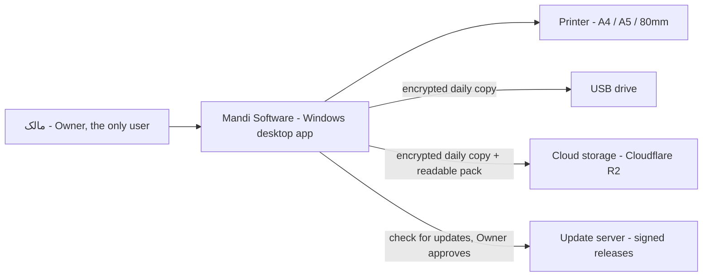
```mermaid
flowchart LR
    owner["مالک - Owner, the only user"]
    app["Mandi Software - Windows desktop app"]
    printer["Printer - A4 / A5 / 80mm"]
    usb["USB drive"]
    cloud["Cloud storage - Cloudflare R2"]
    update["Update server - signed releases"]

    owner --> app
    app --> printer
    app -- "encrypted daily copy" --> usb
    app -- "encrypted daily copy + readable pack" --> cloud
    app -- "check for updates, Owner approves" --> update
```

The app works fully offline. Internet is only used for cloud backup and update checks.

---

## 2. Containers (inside the app)

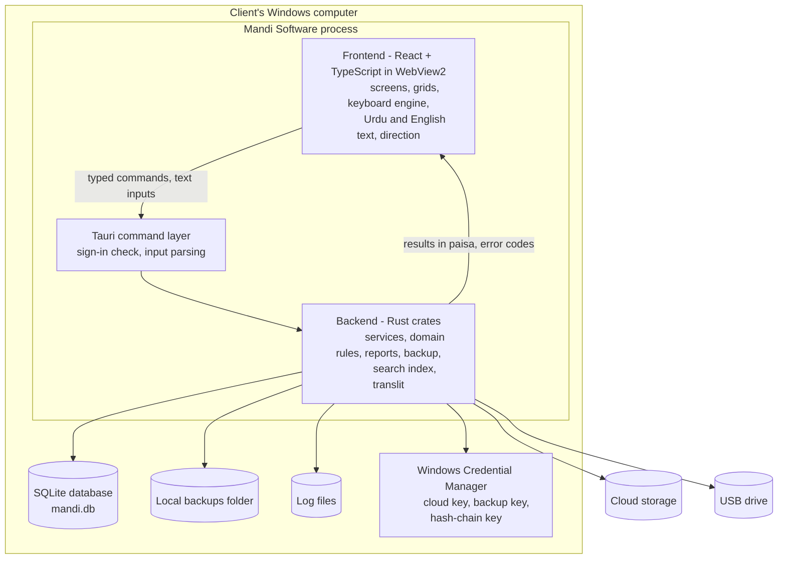
```mermaid
flowchart TB
    subgraph PC["Client's Windows computer"]
        subgraph APP["Mandi Software process"]
            FE["Frontend - React + TypeScript in WebView2
            screens, grids, keyboard engine,
            Urdu and English text, direction"]
            CMD["Tauri command layer
            sign-in check, input parsing"]
            BE["Backend - Rust crates
            services, domain rules, reports, backup,
            search index, translit"]
        end
        DB[("SQLite database
        mandi.db")]
        LB[("Local backups folder")]
        LOG[("Log files")]
        KEY["Windows Credential Manager
        cloud key, backup key, hash-chain key"]
    end
    CLOUD[("Cloud storage")]
    USB[("USB drive")]

    FE -- "typed commands, text inputs" --> CMD
    CMD --> BE
    BE -- "results in paisa, error codes" --> FE
    BE --> DB
    BE --> LB
    BE --> LOG
    BE --> KEY
    BE --> CLOUD
    BE --> USB
```

The frontend only talks to the command layer. It never touches the database, files or network.

---

## 3. Backend layers and crates

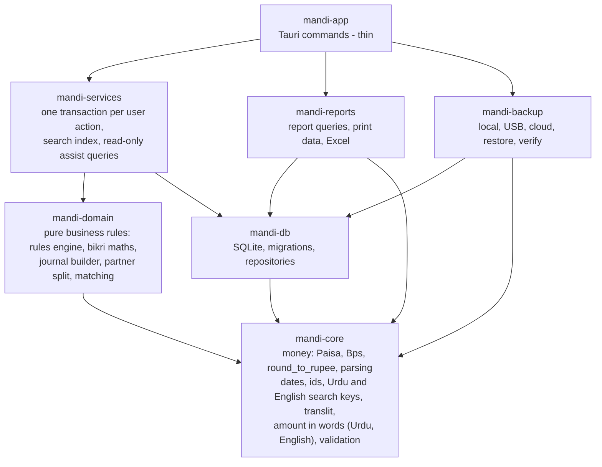
```mermaid
flowchart TB
    APPC["mandi-app
    Tauri commands - thin"]
    SVC["mandi-services
    one transaction per user action,
    search index, read-only assist queries"]
    REP["mandi-reports
    report queries, print data, Excel"]
    BAK["mandi-backup
    local, USB, cloud, restore, verify"]
    DOM["mandi-domain
    pure business rules: rules engine, bikri maths,
    journal builder, partner split, matching"]
    DBC["mandi-db
    SQLite, migrations, repositories"]
    CORE["mandi-core
    money: Paisa, Bps, round_to_rupee, parsing
    dates, ids, Urdu and English search keys, translit,
    amount in words (Urdu, English), validation"]

    APPC --> SVC
    APPC --> REP
    APPC --> BAK
    SVC --> DOM
    SVC --> DBC
    REP --> DBC
    REP --> CORE
    BAK --> DBC
    BAK --> CORE
    DOM --> CORE
    DBC --> CORE
```

Arrows only point down. `mandi-domain` never depends on `mandi-db`. All money maths sits in `mandi-core::money` and `mandi-domain`.

### 3.1 Inside a module (example: bikri)

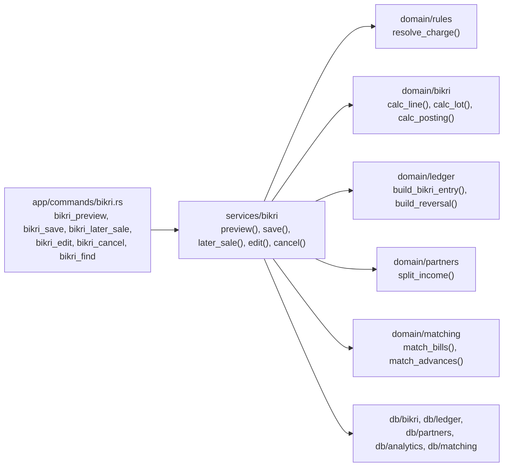
```mermaid
flowchart LR
    C["app/commands/bikri.rs
    bikri_preview, bikri_save, bikri_later_sale,
    bikri_edit, bikri_cancel, bikri_find"]
    S["services/bikri
    preview(), save(), later_sale(), edit(), cancel()"]
    D1["domain/rules
    resolve_charge()"]
    D2["domain/bikri
    calc_line(), calc_lot(), calc_posting()"]
    D3["domain/ledger
    build_bikri_entry(), build_reversal()"]
    D4["domain/partners
    split_income()"]
    D5["domain/matching
    match_bills(), match_advances()"]
    R["db/bikri, db/ledger,
    db/partners, db/analytics, db/matching"]

    C --> S
    S --> D1
    S --> D2
    S --> D3
    S --> D4
    S --> D5
    S --> R
```

---

## 4. Frontend structure

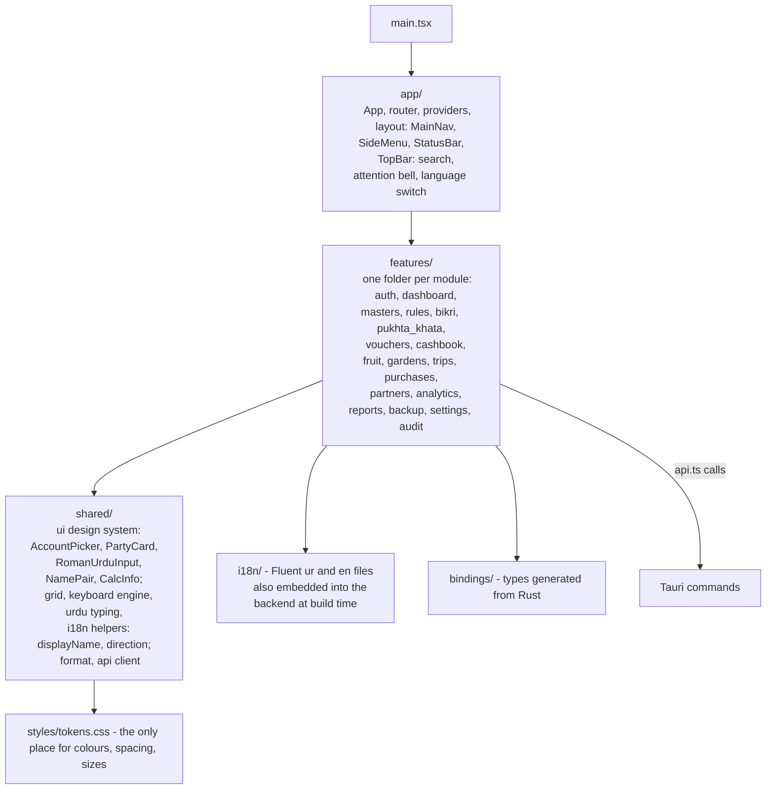
```mermaid
flowchart TB
    MAIN["main.tsx"] --> APPSHELL["app/
    App, router, providers,
    layout: MainNav, SideMenu, StatusBar,
    TopBar: search, attention bell, language switch"]
    APPSHELL --> FEAT["features/
    one folder per module:
    auth, dashboard, masters, rules, bikri, pukhta_khata,
    vouchers, cashbook, fruit, gardens, trips, purchases,
    partners, analytics, reports, backup, settings, audit"]
    FEAT --> SHARED["shared/
    ui design system: AccountPicker, PartyCard,
    RomanUrduInput, NamePair, CalcInfo;
    grid, keyboard engine, urdu typing,
    i18n helpers: displayName, direction;
    format, api client"]
    FEAT --> I18N["i18n/ - Fluent ur and en files
    also embedded into the backend at build time"]
    FEAT --> BIND["bindings/ - types generated from Rust"]
    SHARED --> TOK["styles/tokens.css - the only place for colours, spacing, sizes"]
    FEAT -- "api.ts calls" --> TAURI["Tauri commands"]
```

Each feature folder has the same inside: `pages/`, `components/`, `hooks/`, `api.ts`, `schemas.ts`, `routes.tsx`, `index.ts`.

---

## 5. Screen and navigation map (PRD 5)

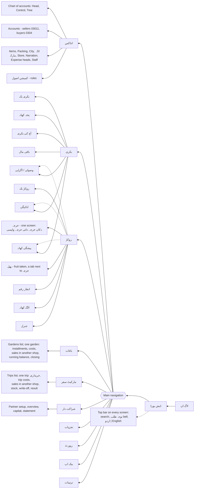
```mermaid
flowchart RL
    LOGIN["لاگ ان"] --> DASH["ڈیش بورڈ"]
    DASH --> NAV{{"Main navigation"}}
    NAV --> IDX["انڈکس"]
    NAV --> BIK["بکری"]
    NAV --> ROK["روکڑ"]
    NAV --> GRD["باغات"]
    NAV --> TRP["مارکیٹ سفر"]
    NAV --> PRT["شراکت دار"]
    NAV --> ANL["تجزیات"]
    NAV --> REP["رپورٹ"]
    NAV --> BAK["بیک اپ"]
    NAV --> SET["ترتیبات"]
    DASH -.-> TOP["Top bar on every screen:
    search, توجہ طلب bell, اردو | English"]

    IDX --> IDX1["Chart of accounts: Head, Control, Tree"]
    IDX --> IDX2["Accounts - sellers 03011, buyers 0304"]
    IDX --> IDX3["Items, Packing, City, اڈا, مارکہ, Store, Narration, Expense heads, Staff"]
    IDX --> IDX4["کمیشن اصول - rules"]

    BIK --> B1["بکری بک"]
    BIK --> B3["وصولی / اگراہی"]
    BIK --> B4["ادائیگی"]
    BIK --> B5["پیشگی کھاتہ"]
    BIK --> B6["پختہ کھاتہ"]
    BIK --> B7["آج کی بکری"]
    BIK --> B8["باقی مال"]
    GRD --> G1["Gardens list; one garden: installments, costs,
    sales in another shop, running balance, closing"]
    TRP --> T1["Trips list; one trip: خریداری, trip costs,
    sales in another shop, stock, write-off, result"]
    PRT --> P1["Partner setup, overview, capital, statement"]

    ROK --> R1["روکڑ بک"]
    ROK --> R2["خرچہ - one screen:
    دکان خرچہ, ذاتی خرچہ, واپسی"]
    ROK --> R6["پھل - fruit taken, a tab next to خرچہ"]
    ROK --> R3["ادھار رقم"]
    ROK --> R5["الگ کھاتہ"]
    ROK --> R4["جنرل"]
    ROK -.-> B3
    ROK -.-> B4
    ROK -.-> B5
```

Dotted lines: the same screens are reachable from روکڑ (PRD FR-15.10). B3, B4 and B5 are one voucher screen, opened with its type already chosen. Related entries share one screen with a type list at the top (PRD FR-7.67): R2 holds دکان خرچہ and ذاتی خرچہ, R3 lent and returned, R5 paid out and received, G1 a garden's entries, T1 a trip's entries (v1.6).

---

## 6. Module interconnection (PRD 6)

Every action is a posting event. Each arrow is written inside that action's single save.

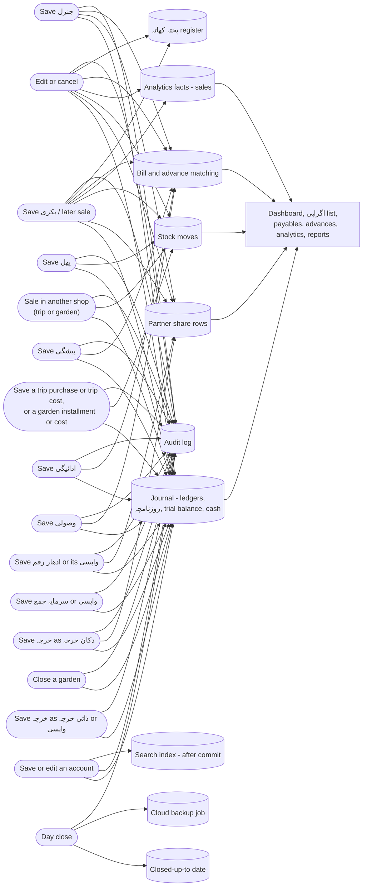
```mermaid
flowchart LR
    SAVE_BIKRI(["Save بکری / later sale"])
    EDIT(["Edit or cancel"])
    SAVE_REC(["Save وصولی"])
    SAVE_PAY(["Save ادائیگی"])
    SAVE_ADV(["Save پیشگی"])
    SAVE_SHOP(["Save خرچہ as دکان خرچہ"])
    SAVE_PERS(["Save خرچہ as ذاتی خرچہ or واپسی"])
    SAVE_LENT(["Save ادھار رقم or its واپسی"])
    SAVE_PUR(["Save a trip purchase or trip cost,
    or a garden installment or cost"])
    SAVE_OTHER(["Sale in another shop
    (trip or garden)"])
    SAVE_GCLOSE(["Close a garden"])
    SAVE_FRUIT(["Save پھل"])
    SAVE_CAP(["Save سرمایہ جمع or واپسی"])
    SAVE_GEN(["Save جنرل"])
    DAYC(["Day close"])

    JRN[("Journal - ledgers,
    روزنامچہ, trial balance, cash")]
    SPLIT[("Partner share rows")]
    STOCK[("Stock moves")]
    FACTS[("Analytics facts - sales")]
    MATCH[("Bill and advance matching")]
    PUKHTA[("پختہ کھاتہ register")]
    AUD[("Audit log")]
    DAYS[("Closed-up-to date")]
    BACKUP[("Cloud backup job")]
    DASHV["Dashboard, اگراہی list,
    payables, advances, analytics, reports"]

    SAVE_BIKRI --> JRN & SPLIT & STOCK & FACTS & MATCH & PUKHTA & AUD
    EDIT --> JRN & SPLIT & STOCK & FACTS & MATCH & PUKHTA & AUD
    SAVE_REC --> JRN & MATCH & AUD
    SAVE_PAY --> JRN & MATCH & AUD
    SAVE_ADV --> JRN & MATCH & AUD
    SAVE_SHOP --> JRN & SPLIT & AUD
    SAVE_PERS --> JRN & AUD
    SAVE_LENT --> JRN & SPLIT & AUD
    SAVE_PUR --> JRN & STOCK & AUD
    SAVE_OTHER --> JRN & STOCK & AUD
    SAVE_GCLOSE --> JRN & AUD
    SAVE_FRUIT --> JRN & STOCK & AUD
    SAVE_CAP --> JRN & AUD
    SAVE_GEN --> JRN & SPLIT & MATCH & AUD
    SAVE_ACC(["Save or edit an account"]) --> JRN & AUD & SIDX[("Search index - after commit")]
    DAYC --> DAYS & BACKUP & AUD

    JRN & SPLIT & STOCK & FACTS & MATCH --> DASHV
```

Sales analytics read `analytics_facts`. Expense and profit analytics read the journal and partner share rows (PRD FR-18.6). Garden, trip and fruit analytics read their own tables and the journal lines of the 0604 and 0306 accounts. No screen keeps its own totals (PRD FR-6.1). A garden or trip payment from pockets only writes no journal entry (PRD FR-12.30).

---

## 7. Save a بکری: live preview and save (PRD 12.5, 12.6)

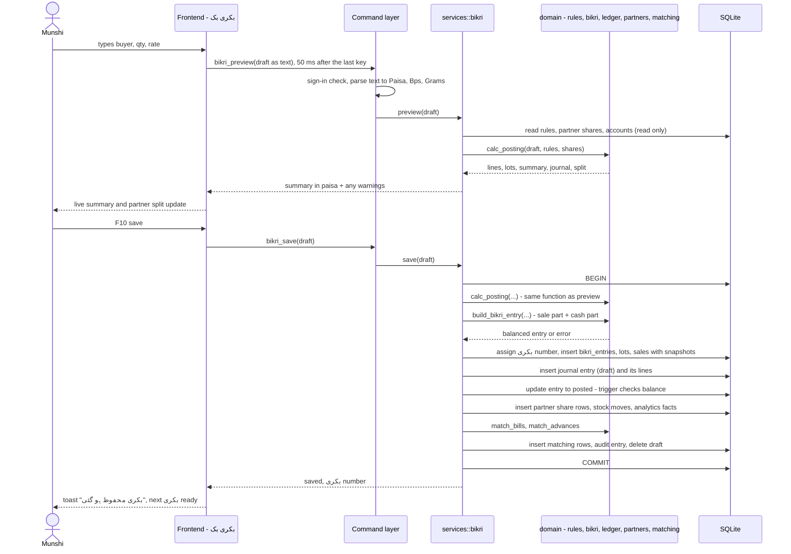
```mermaid
sequenceDiagram
    actor U as Munshi
    participant FE as Frontend - بکری بک
    participant CMD as Command layer
    participant SVC as services::bikri
    participant DOM as domain - rules, bikri, ledger, partners, matching
    participant DB as SQLite

    U->>FE: types buyer, qty, rate
    FE->>CMD: bikri_preview(draft as text), 50 ms after the last key
    CMD->>CMD: sign-in check, parse text to Paisa, Bps, Grams
    CMD->>SVC: preview(draft)
    SVC->>DB: read rules, partner shares, accounts (read only)
    SVC->>DOM: calc_posting(draft, rules, shares)
    DOM-->>SVC: lines, lots, summary, journal, split
    SVC-->>FE: summary in paisa + any warnings
    FE-->>U: live summary and partner split update

    U->>FE: F10 save
    FE->>CMD: bikri_save(draft)
    CMD->>SVC: save(draft)
    SVC->>DB: BEGIN
    SVC->>DOM: calc_posting(...) - same function as preview
    SVC->>DOM: build_bikri_entry(...) - sale part + cash part
    DOM-->>SVC: balanced entry or error
    SVC->>DB: assign بکری number, insert bikri_entries, lots, sales with snapshots
    SVC->>DB: insert journal entry (draft) and its lines
    SVC->>DB: update entry to posted - trigger checks balance
    SVC->>DB: insert partner share rows, stock moves, analytics facts
    SVC->>DOM: match_bills, match_advances
    SVC->>DB: insert matching rows, audit entry, delete draft
    SVC->>DB: COMMIT
    SVC-->>FE: saved, بکری number
    FE-->>U: toast "بکری محفوظ ہو گئی", next بکری ready
```

If anything fails before COMMIT, the whole save is rolled back and the user sees one clear Urdu message (NFR-REL-1).

---

## 8. Charge rule resolution (PRD 11)

Used for every allowed charge (PRD 11.2). The rule date is the posting date. The party is the seller for seller-side charges and the buyer for buyer-side charges.

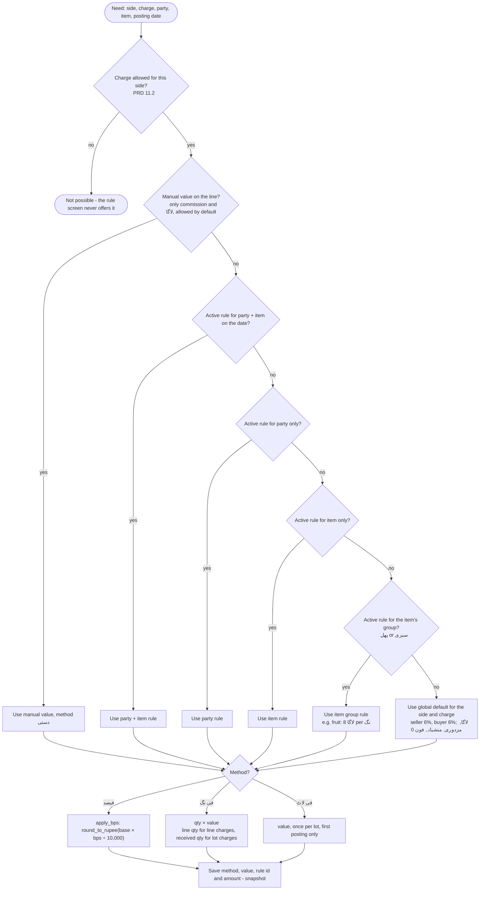
```mermaid
flowchart TD
    START(["Need: side, charge, party, item, posting date"]) --> ALLOW{"Charge allowed for this side?
    PRD 11.2"}
    ALLOW -- no --> NA(["Not possible - the rule screen never offers it"])
    ALLOW -- yes --> P1{"Manual value on the line?
    only commission and لاگا, allowed by default"}
    P1 -- yes --> USE1["Use manual value, method دستی"]
    P1 -- no --> P2{"Active rule for party + item on the date?"}
    P2 -- yes --> USE2["Use party + item rule"]
    P2 -- no --> P3{"Active rule for party only?"}
    P3 -- yes --> USE3["Use party rule"]
    P3 -- no --> P4{"Active rule for item only?"}
    P4 -- yes --> USE4["Use item rule"]
    P4 -- no --> P5{"Active rule for the item's group?
    پھل or سبزی"}
    P5 -- yes --> USE5["Use item group rule
    e.g. fruit: لاگا 8 per نگ"]
    P5 -- no --> USE6["Use global default for the side and charge
    seller 6%, buyer 6%; لاگا, مزدوری, منشیانہ, فون 0"]
    USE1 & USE2 & USE3 & USE4 & USE5 & USE6 --> M{"Method?"}
    M -- "فیصد" --> PCT["apply_bps: round_to_rupee(base × bps ÷ 10,000)"]
    M -- "فی نگ" --> PU["qty × value
    line qty for line charges, received qty for lot charges"]
    M -- "فی لاٹ" --> PL["value, once per lot, first posting only"]
    PCT & PU & PL --> SNAP["Save method, value, rule id and amount - snapshot"]
```

Tie rule: two rules at the same level overlapping in dates, the newer one wins (FR-11.5): the later start date, and on the same start date the one saved last. There is no party + item group level: a rule with a party never has an item group (PRD 11.1). Unchanged lines in an edit skip this whole flow and keep their snapshot (FR-12.20).

---

## 9. Journal of a بکری posting (PRD FR-12.9)

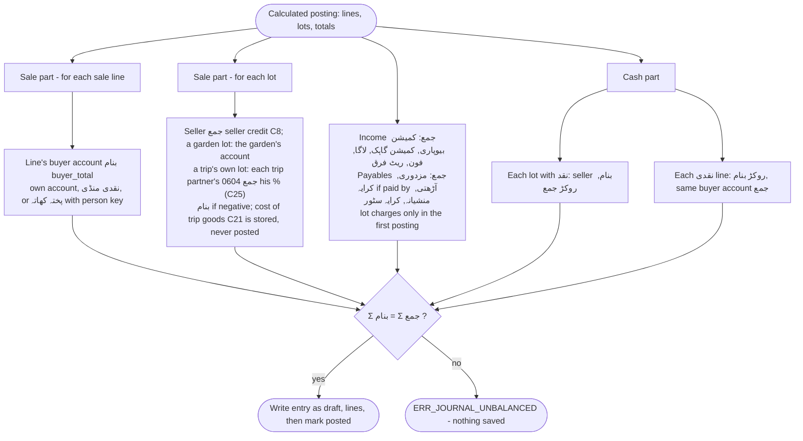
```mermaid
flowchart TD
    IN(["Calculated posting: lines, lots, totals"]) --> L1["Sale part - for each sale line"]
    L1 --> DRB["Line's buyer account بنام buyer_total
    own account, نقدی منڈی, or پختہ کھاتہ with person key"]
    IN --> L2["Sale part - for each lot"]
    L2 --> CRS["Seller جمع seller credit C8; a garden lot: the garden's account
    a trip's own lot: each trip partner's 0604 جمع his % (C25)
    بنام if negative; cost of trip goods C21 is stored, never posted"]
    IN --> INC["Income جمع: کمیشن بیوپاری, کمیشن گاہک, لاگا, فون, ریٹ فرق
    Payables جمع: مزدوری, کرایہ if paid by آڑھتی, منشیانہ, کرایہ سٹور
    lot charges only in the first posting"]
    IN --> L3["Cash part"]
    L3 --> CSH["Each lot with نقد: seller بنام, روکڑ جمع"]
    L3 --> CSB["Each نقدی line: روکڑ بنام, same buyer account جمع"]
    DRB & CRS & INC & CSH & CSB --> CHK{"Σ بنام = Σ جمع ?"}
    CHK -- yes --> OK(["Write entry as draft, lines, then mark posted"])
    CHK -- no --> ERR(["ERR_JOURNAL_UNBALANCED - nothing saved"])
```

Worked check from PRD 4.4. Sale part: بنام 12,880 + 18,684 = 31,564; جمع 24,316 + 1,764 + 1,764 + 400 + 20 + 250 + 3,000 + 50 = 31,564. Cash part adds 5,000 on each side. Whole entry 36,564 = 36,564.

No journal line holds a negative number. A negative amount (for example a negative seller credit or a negative ریٹ فرق) is written on the opposite side.

---

## 10. Partner split (PRD 17, C10, C11)

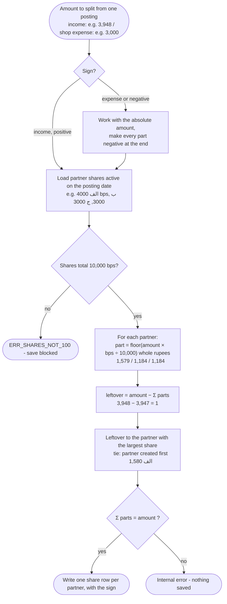
```mermaid
flowchart TD
    A(["Amount to split from one posting
    income: e.g. 3,948 / shop expense: e.g. 3,000"]) --> S{"Sign?"}
    S -- "expense or negative" --> ABS["Work with the absolute amount,
    make every part negative at the end"]
    S -- "income, positive" --> B
    ABS --> B["Load partner shares active on the posting date
    e.g. الف 4000 bps, ب 3000, ج 3000"]
    B --> C{"Shares total 10,000 bps?"}
    C -- no --> E(["ERR_SHARES_NOT_100 - save blocked"])
    C -- yes --> D["For each partner:
    part = floor(amount × bps ÷ 10,000) whole rupees
    1,579 / 1,184 / 1,184"]
    D --> F["leftover = amount − Σ parts
    3,948 − 3,947 = 1"]
    F --> G["Leftover to the partner with the largest share
    tie: partner created first
    الف 1,580"]
    G --> H{"Σ parts = amount ?"}
    H -- yes --> I(["Write one share row per partner, with the sign"])
    H -- no --> J(["Internal error - nothing saved"])
```

Example of the negative case (E2E-20): an expense of 3,384 splits as 1,354 / 1,015 / 1,015 and is recorded as −1,354 / −1,015 / −1,015.

---

## 11. وصولی with oldest-first matching (PRD 15.2, 13)

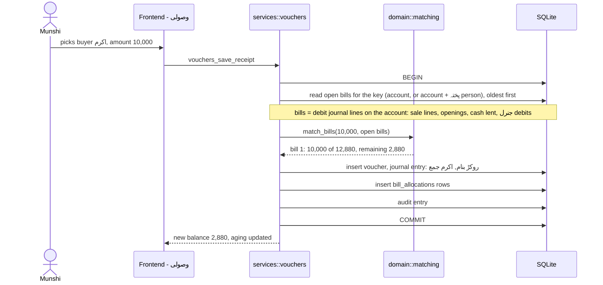
```mermaid
sequenceDiagram
    actor U as Munshi
    participant FE as Frontend - وصولی
    participant SVC as services::vouchers
    participant DOM as domain::matching
    participant DB as SQLite

    U->>FE: picks buyer اکرم, amount 10,000
    FE->>SVC: vouchers_save_receipt
    SVC->>DB: BEGIN
    SVC->>DB: read open bills for the key (account, or account + پختہ person), oldest first
    Note over SVC,DB: bills = debit journal lines on the account: sale lines, openings, cash lent, جنرل debits
    SVC->>DOM: match_bills(10,000, open bills)
    DOM-->>SVC: bill 1: 10,000 of 12,880, remaining 2,880
    SVC->>DB: insert voucher, journal entry: روکڑ بنام, اکرم جمع
    SVC->>DB: insert bill_allocations rows
    SVC->>DB: audit entry
    SVC->>DB: COMMIT
    SVC-->>FE: new balance 2,880, aging updated
```

If the amount is more than all open bills, the extra stays as the buyer's credit and is matched to his next bill (FR-15.5). Advances to sellers use the same flow with `match_advances` (FR-15.8).

---

## 12. Edit and cancel by reversal (PRD 12.9)

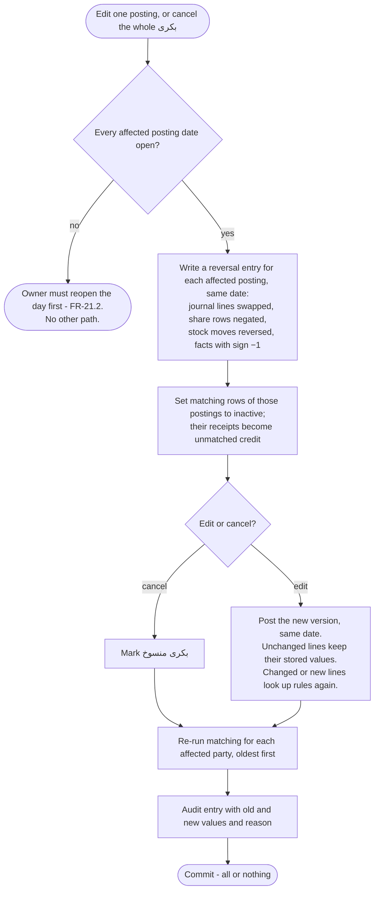
```mermaid
flowchart TD
    S(["Edit one posting, or cancel the whole بکری"]) --> D{"Every affected posting date open?"}
    D -- no --> O(["Owner must reopen the day first - FR-21.2.
    No other path."])
    D -- yes --> R["Write a reversal entry for each affected posting, same date:
    journal lines swapped, share rows negated,
    stock moves reversed, facts with sign −1"]
    R --> M["Set matching rows of those postings to inactive;
    their receipts become unmatched credit"]
    M --> K{"Edit or cancel?"}
    K -- cancel --> C["Mark بکری منسوخ"]
    K -- edit --> N["Post the new version, same date.
    Unchanged lines keep their stored values.
    Changed or new lines look up rules again."]
    C & N --> RM["Re-run matching for each affected party, oldest first"]
    RM --> A["Audit entry with old and new values and reason"]
    A --> Z(["Commit - all or nothing"])
```

Posted journal lines are never changed or deleted, only reversed.

---

## 13. Life cycles

### 13.1 بکری

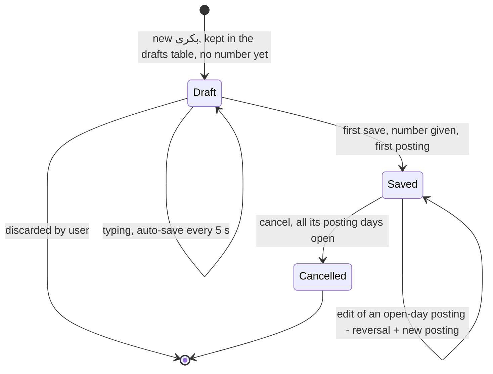
```mermaid
stateDiagram-v2
    [*] --> Draft: new بکری, kept in the drafts table, no number yet
    Draft --> Draft: typing, auto-save every 5 s
    Draft --> Saved: first save, number given, first posting
    Draft --> [*]: discarded by user
    Saved --> Saved: later sale - new posting
    Saved --> Saved: edit of an open-day posting - reversal + new posting
    Saved --> Cancelled: cancel, all its posting days open
    Cancelled --> [*]
```

### 13.2 Days (one "closed up to" date)

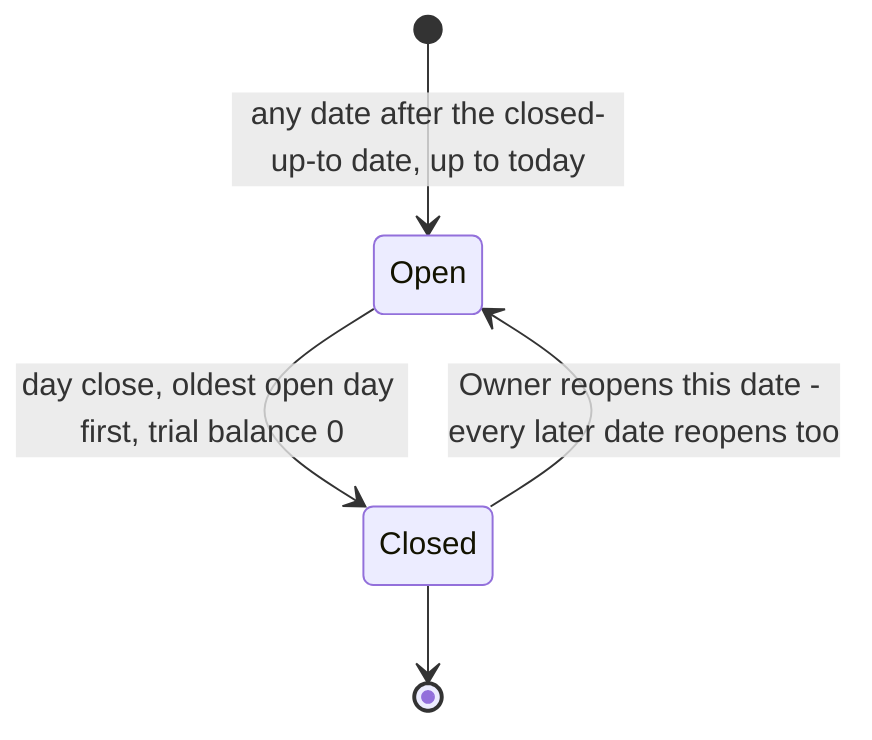
```mermaid
stateDiagram-v2
    [*] --> Open: any date after the closed-up-to date, up to today
    Open --> Closed: day close, oldest open day first, trial balance 0
    Closed --> Open: Owner reopens this date - every later date reopens too
    Closed --> [*]
```

### 13.3 Lot stock

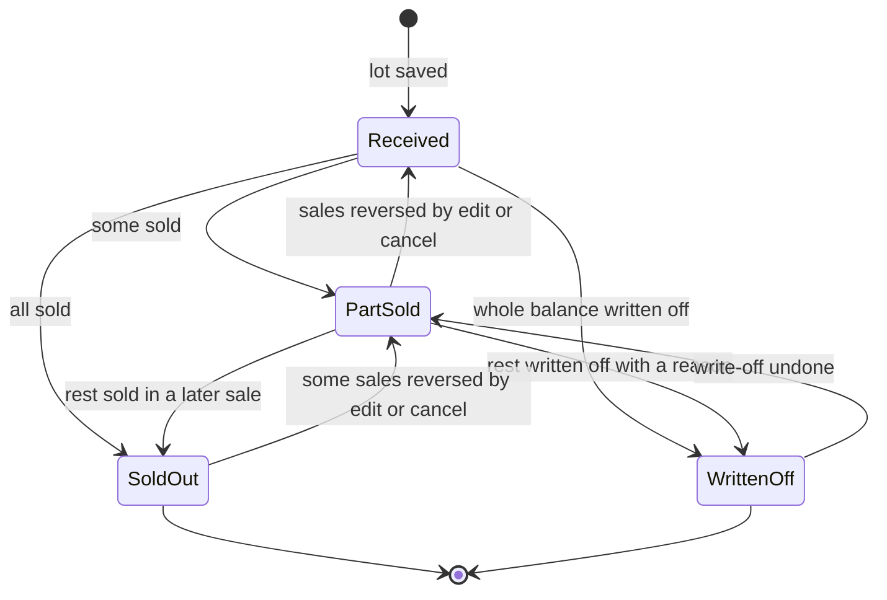
```mermaid
stateDiagram-v2
    [*] --> Received: lot saved
    Received --> PartSold: some sold
    Received --> SoldOut: all sold
    Received --> WrittenOff: whole balance written off
    PartSold --> SoldOut: rest sold in a later sale
    PartSold --> WrittenOff: rest written off with a reason
    PartSold --> Received: sales reversed by edit or cancel
    SoldOut --> PartSold: some sales reversed by edit or cancel
    WrittenOff --> PartSold: write-off undone
    SoldOut --> [*]
    WrittenOff --> [*]
```

### 13.4 Backup job

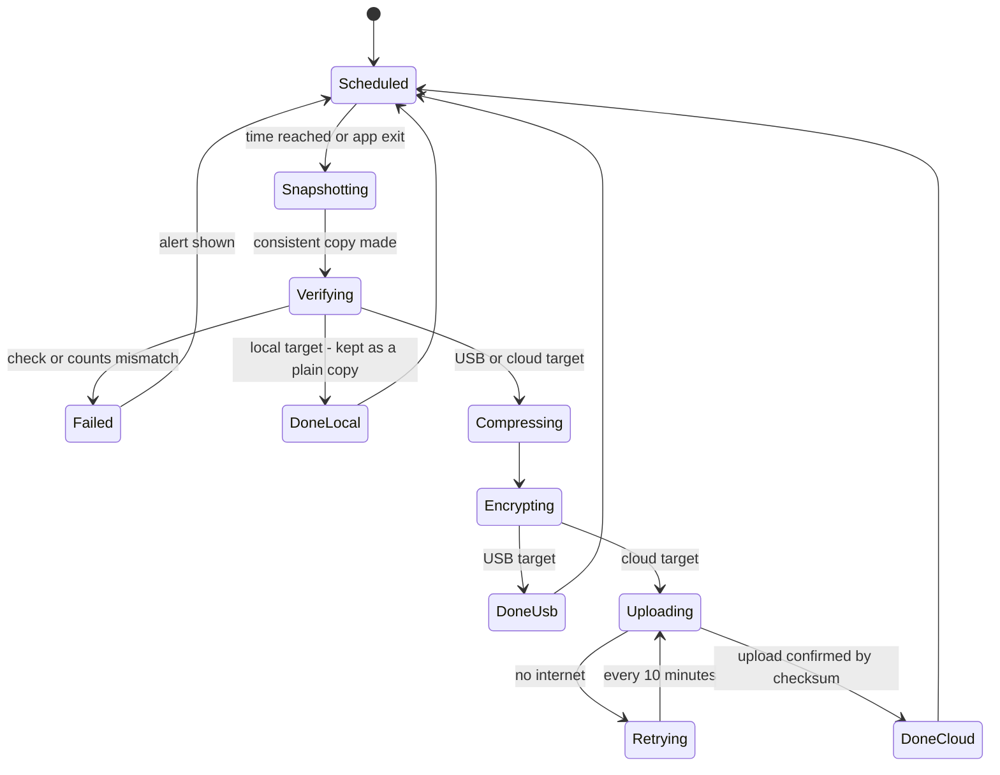
```mermaid
stateDiagram-v2
    [*] --> Scheduled
    Scheduled --> Snapshotting: time reached or app exit
    Snapshotting --> Verifying: consistent copy made
    Verifying --> Failed: check or counts mismatch
    Verifying --> DoneLocal: local target - kept as a plain copy
    Verifying --> Compressing: USB or cloud target
    Compressing --> Encrypting
    Encrypting --> DoneUsb: USB target
    Encrypting --> Uploading: cloud target
    Uploading --> Retrying: no internet
    Retrying --> Uploading: every 10 minutes
    Uploading --> DoneCloud: upload confirmed by checksum
    Failed --> Scheduled: alert shown
    DoneLocal --> Scheduled
    DoneUsb --> Scheduled
    DoneCloud --> Scheduled
```

---

## 14. Backup and restore (PRD 20, NFR 4)

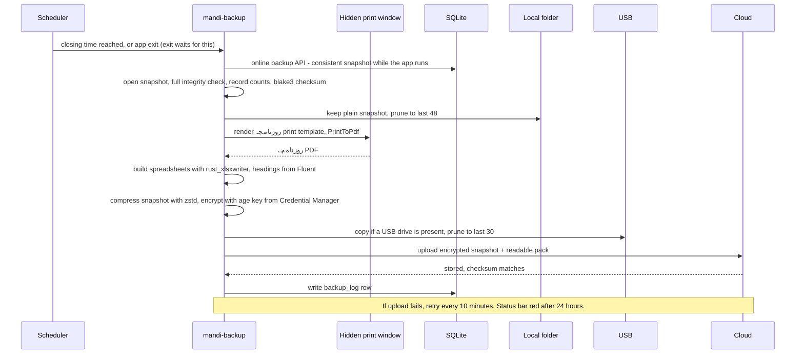
```mermaid
sequenceDiagram
    participant T as Scheduler
    participant B as mandi-backup
    participant W as Hidden print window
    participant DB as SQLite
    participant L as Local folder
    participant U as USB
    participant C as Cloud

    T->>B: closing time reached, or app exit (exit waits for this)
    B->>DB: online backup API - consistent snapshot while the app runs
    B->>B: open snapshot, full integrity check, record counts, blake3 checksum
    B->>L: keep plain snapshot, prune to last 48
    B->>W: render روزنامچہ print template, PrintToPdf
    W-->>B: روزنامچہ PDF
    B->>B: build spreadsheets with rust_xlsxwriter, headings from Fluent
    B->>B: compress snapshot with zstd, encrypt with age key from Credential Manager
    B->>U: copy if a USB drive is present, prune to last 30
    B->>C: upload encrypted snapshot + readable pack
    C-->>B: stored, checksum matches
    B->>DB: write backup_log row
    Note over B,C: If upload fails, retry every 10 minutes. Status bar red after 24 hours.
```

The 15-minute local copies follow only the first four steps.

Restore:

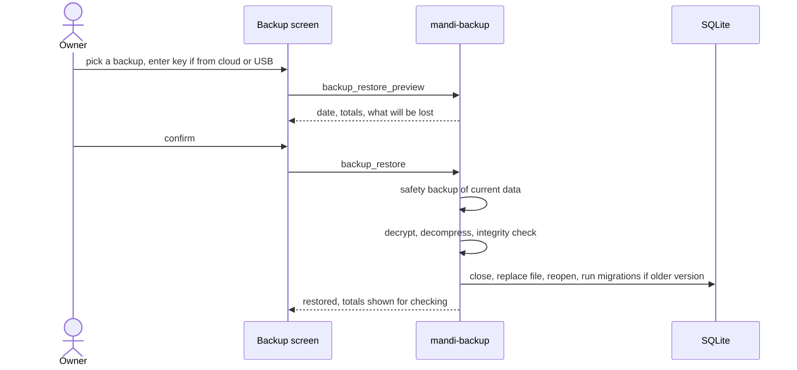
```mermaid
sequenceDiagram
    actor O as Owner
    participant FE as Backup screen
    participant B as mandi-backup
    participant DB as SQLite

    O->>FE: pick a backup, enter key if from cloud or USB
    FE->>B: backup_restore_preview
    B-->>FE: date, totals, what will be lost
    O->>FE: confirm
    FE->>B: backup_restore
    B->>B: safety backup of current data
    B->>B: decrypt, decompress, integrity check
    B->>DB: close, replace file, reopen, run migrations if older version
    B-->>FE: restored, totals shown for checking
```

---

## 15. Data model

### 15.1 Diagram (main relationships)

System columns are left out to keep the diagram readable.

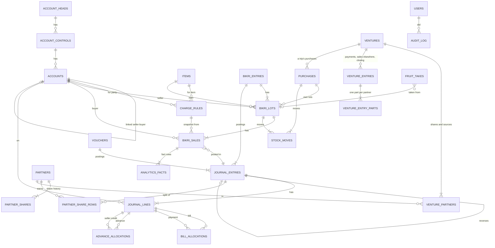
```mermaid
erDiagram
    ACCOUNT_HEADS ||--o{ ACCOUNT_CONTROLS : has
    ACCOUNT_CONTROLS ||--o{ ACCOUNTS : has
    ACCOUNTS ||--o| ACCOUNTS : "linked seller-buyer"
    ITEMS ||--o{ CHARGE_RULES : "for item"
    ACCOUNTS ||--o{ CHARGE_RULES : "for party"

    BIKRI_ENTRIES ||--|{ BIKRI_LOTS : has
    BIKRI_LOTS ||--|{ BIKRI_SALES : has
    ACCOUNTS ||--o{ BIKRI_LOTS : seller
    ACCOUNTS ||--o{ BIKRI_SALES : buyer
    ITEMS ||--o{ BIKRI_LOTS : item
    CHARGE_RULES ||--o{ BIKRI_SALES : "snapshot from"

    JOURNAL_ENTRIES ||--|{ JOURNAL_LINES : has
    JOURNAL_ENTRIES ||--o| JOURNAL_ENTRIES : "reverses"
    BIKRI_ENTRIES ||--|{ JOURNAL_ENTRIES : "postings"
    VOUCHERS ||--|{ JOURNAL_ENTRIES : "postings"
    BIKRI_SALES }o--|| JOURNAL_ENTRIES : "posted in"
    ACCOUNTS ||--o{ JOURNAL_LINES : on

    JOURNAL_LINES ||--o{ BILL_ALLOCATIONS : "bill"
    JOURNAL_LINES ||--o{ BILL_ALLOCATIONS : "payment"
    JOURNAL_LINES ||--o{ ADVANCE_ALLOCATIONS : "advance"
    JOURNAL_LINES ||--o{ ADVANCE_ALLOCATIONS : "seller credit"

    PARTNERS ||--|{ PARTNER_SHARES : "share history"
    PARTNERS ||--o{ PARTNER_SHARE_ROWS : earns
    JOURNAL_ENTRIES ||--o{ PARTNER_SHARE_ROWS : "split of"

    BIKRI_SALES ||--|{ ANALYTICS_FACTS : "fact rows"
    BIKRI_LOTS ||--|{ STOCK_MOVES : moves
    PURCHASES ||--o{ BIKRI_LOTS : "own lots"
    PURCHASES ||--|{ STOCK_MOVES : moves
    VENTURES ||--|{ VENTURE_PARTNERS : "shares and sources"
    VENTURES ||--o{ VENTURE_ENTRIES : "payments, sales elsewhere, closing"
    VENTURE_ENTRIES ||--|{ VENTURE_ENTRY_PARTS : "one part per partner"
    VENTURES ||--o{ PURCHASES : "a trip's purchases"
    PARTNERS ||--o{ VENTURE_PARTNERS : in
    FRUIT_TAKES }o--o| BIKRI_LOTS : "taken from"
    USERS ||--o{ AUDIT_LOG : did
```

### 15.2 Rules for every table

- Every table has these system columns: `id INTEGER PRIMARY KEY`, `created_at TEXT`, `created_by INTEGER`, `updated_at TEXT`, `updated_by INTEGER`, `version INTEGER`.
- All tables are `STRICT`. Foreign keys are on.
- Money columns are `INTEGER` paisa, end in `_paisa`, and are always a multiple of 100 (`CHECK (x_paisa % 100 = 0)`).
- Rates end in `_bps` (`INTEGER`, 1% = 100). Weights end in `_grams` (`INTEGER`). Dates end in `_date` (`TEXT YYYY-MM-DD`). Times end in `_at` (`TEXT`, UTC).
- Every named record has `name_ur` and `name_en`, both `NOT NULL` (PRD FR-7.24, Code Standards 4.2), plus three indexed search columns built only by `core::text`: `search_ur` (normalised Urdu), `search_en` (lower-case English) and `search_phonetic`. Below, "+ search columns" means these three.
- Append-only tables (Code Standards B17): `journal_lines`, `audit_log`, `partner_share_rows`, `stock_moves`, `analytics_facts`. `journal_entries` allows only `draft` to `posted`.

### 15.3 Security, settings, operations

| Table | Columns (besides system columns) |
|---|---|
| `users` | One row only, the Owner (PRD Section 2). `username` (unique), `password_hash`, `display_name`, `role` (kept from migration 0001, always owner; no check reads it), `partner_id` (always null, not used), `is_active`, `failed_attempts`, `locked_until_at`, `last_login_at` |
| `settings` | `key` (unique), `value_json`. Includes `firm_contacts` (up to 3: name_ur, name_en, phone) and `trade_mark` (text), printed in every print header (PRD 21, FR-19.13, v1.7), `default_language` (the backup pack language, PRD 21) and the computer-level `login_language` (last language used on this computer, PRD FR-7.30). |
| `audit_log` | `at`, `user_id`, `action`, `entity`, `entity_id`, `old_json`, `new_json`, `reason`, `chain_hash` |
| `day_state` | single row: `closed_up_to_date` |
| `day_closes` | `entry_date`, `action` (close, reopen), `by_user_id`, `at`, `reason`, `summary_json` |
| `month_closes` | `month` (YYYY-MM), `journal_entry_id`, `is_active`, `reversed_entry_id` (null) |
| `drafts` | `screen`, `user_id`, `payload_json`, `saved_at` |
| `backup_log` | `at`, `kind` (local, usb, cloud), `path_or_key`, `size_bytes`, `checksum`, `integrity_ok`, `row_counts_json`, `error` |
| `user_prefs` | `user_id`, `key`, `value_json`. Unique (`user_id`, `key`). Keys: `language` (ur, en; ur at first run, PRD FR-7.30), `text_size`, `last_screen`, `filters.<screen>`, `print_after_save`, `recent.<screen>` (last 10 record IDs). PRD FR-7.30, FR-7.41, FR-7.45, FR-7.57. |
| `translit_pairs` | `roman` (lower case), `urdu`, `kind` (name, place, item, word), `use_count`, `last_used_at`. Unique (`roman`, `urdu`). Learned pairs only; the starting word list is a file inside the app (Tech Stack 4.4). PRD FR-7.26. |

### 15.4 Chart of accounts and masters

| Table | Columns |
|---|---|
| `account_heads` | `code` (unique), `name_ur`, `name_en`, `nature` (asset, payable, party, income, expense, capital) |
| `account_controls` | `head_id`, `code` (unique), `name_ur`, `name_en`, `party_type` (seller, buyer, separate, garden, other; separate = a الگ کھاتہ under control 0305, PRD 16.6; garden = a garden's account under control 0306, PRD 12.11) |
| `accounts` | `control_id`, `code` (unique), `serial`, `party_type`, `name_ur`, `name_en`, `tag` (null; 1 to 4 English capital letters and dots, shown after the name, PRD 10.2, v1.7), + search columns (the tag is in the search keys), `father_or_firm_ur`, `father_or_firm_en`, `city_id`, `adda_id`, `phone1`, `phone2`, `address`, `linked_account_id`, `opening_date`, `opening_dr_paisa`, `opening_cr_paisa`, `opening_is_advance`, `opening_entry_id`, `credit_allowed`, `credit_limit_paisa`, `default_marka_id`, `collector_staff_id`, `collection_weekday`, `is_system`, `is_pukhta_khata`, `is_active`, `note` |
| `cities` | `code`, `name_ur`, `name_en`, + search columns, `is_active` |
| `items` | `code`, `name_ur`, `name_en`, + search columns, `item_group` (fruit, vegetable), `default_packing_id`, `sold_by` (unit, weight), `is_active` |
| `packings` | `code`, `name_ur`, `name_en`, + search columns, `approx_grams`, `is_active` |
| `addas` | `code`, `name_ur`, `name_en`, + search columns, `city_id`, `is_active` |
| `markas` | `code`, `mark_text` (as typed, one script), `owner_account_id`, `is_active` |
| `stores` | `code`, `name_ur`, `name_en`, + search columns, `is_active` |
| `narrations` | `text_ur`, `text_en`, `used_in_json`, `is_active` |
| `expense_heads` | `code`, `name_ur`, `name_en`, + search columns, `account_id`, `is_active` |
| `staff` | `name_ur`, `name_en`, + search columns, `role` (munshi, collector, labour; the job, not a login role), `phone`, `account_id` (null; his ادھار رقم account under control 0103, made the first time he is lent money), `is_active` |
| `bank_accounts` | `bank_name`, `title`, `number` (all as typed, one script), `account_id`, `is_active`. Kept from migration 0001; not used from v1.6 (PRD FR-10.4: all money is روکڑ). |

### 15.5 Rules and partners

| Table | Columns |
|---|---|
| `charge_rules` | `side` (seller, buyer), `charge_type` (commission, laga, labour, munshiana, phone), `account_id` (null = any), `item_id` (null = any), `item_group` (fruit, vegetable; null = any; only when `item_id` and `account_id` are both null, PRD 11.1), `method` (percent, per_unit, per_lot), `value_bps` (for percent), `value_paisa` (for per_unit and per_lot), `from_date`, `to_date` (null), `is_active`, `note`. CHECK: exactly one of `value_bps`, `value_paisa` is set, matching the method; CHECK: only the combinations in PRD 11.2. |
| `partners` | `name_ur`, `name_en`, `user_id` (always null, not used; partners do not log in), `capital_account_id`, `drawings_account_id`, `venture_account_id` (his garden, trip and fruit account under control 0604, v1.6), `is_active` (the "created first" tie rule uses the lowest `id`) |
| `partner_shares` | `partner_id`, `share_bps`, `effective_from` (not earlier than the day it was entered) |
| `partner_share_rows` | `journal_entry_id`, `entry_date`, `partner_id`, `kind` (income, expense), `base_paisa`, `share_bps`, `amount_paisa` (signed) |
| `ventures` | Gardens and trips (PRD 12.10, 12.11). `kind` (garden, trip), `number` (unique per kind, given at save), `entry_date`, `name_ur`, `name_en` + search columns (garden; a trip's are made from its number and date), `item_id` (null), `rent_paisa` (garden; 0 for a trip), `season_end_date` (null), `market`, `sent_person` (trip, as typed), `account_id` (garden: its account under 0306; null for a trip), `status` (open, closed), `closed_date` (null), `close_entry_id` (null), `note` |
| `venture_partners` | `venture_id`, `partner_id`, `share_bps`, `source` (shop, pocket). Unique (`venture_id`, `partner_id`). The rows of one venture total 10,000 bps. No change after its first entry (PRD FR-12.29). |
| `venture_entries` | `venture_id`, `kind` (installment, cost, purchase, other_sale, close), `number` (unique per kind), `entry_date`, `amount_paisa` (the payment, or the money received), `reason`, `purchase_id` (null; a trip purchase, or the purchase sold in another shop), `qty` (null; other_sale), `shop_name` (null; as typed), `journal_entry_id` (null when nothing posts, PRD FR-12.30), `status` (saved, cancelled), `cancel_reason`, `current_entry_id` |
| `venture_entry_parts` | `entry_id`, `partner_id`, `share_bps`, `source` (shop, pocket), `amount_paisa`. One row per partner in the venture; the parts add up to the entry's amount (C23, C25, C26). A pocket part has no journal line. |

### 15.6 Sales and stock

| Table | Columns |
|---|---|
| `bikri_entries` | `number` (unique, given at first save), `book`, `entry_date`, `bill_date`, `truck_no`, `zamindar_account_id`, `adda_id`, `driver_name`, `driver_phone`, `total_freight_paisa`, `store_id`, `note`, `status` (saved, cancelled), `cancel_reason`, `cancelled_by`, `cancelled_at`, `print_count` |
| `bikri_lots` | `bikri_id`, `lot_no`, `seller_account_id`, `pukhta_name_ur`, `pukhta_name_en`, `pukhta_phone`, `pukhta_person_key`, `item_id`, `packing_id`, `marka_id`, `store_id`, `qty_received`, `weight_received_grams`, `freight_paisa`, `freight_paid_by` (firm, seller), `labour_method`, `labour_value_paisa`, `labour_paisa`, `labour_rule_id`, `munshiana_method`, `munshiana_value_paisa`, `munshiana_paisa`, `munshiana_rule_id`, `phone_method`, `phone_value_paisa`, `phone_paisa`, `phone_rule_id` (method per_unit, per_lot or manual; PRD FR-12.20), `cash_paid_paisa`, `store_rent_paisa`, `adjust_advance` (0 or 1, default 1; PRD FR-12.23), `purchase_id` (null; set when the seller is اپنا مال, PRD FR-12.26), `first_entry_id`, and kept up to date in the same save: `qty_sold`, `qty_written_off`, `qty_taken` (fruit taken, PRD FR-16.11, v1.6), `gross_paisa`, `seller_comm_paisa`, `deductions_paisa`, `net_paisa` |
| `bikri_sales` | `bikri_id`, `lot_id`, `line_no`, `journal_entry_id` (the posting it belongs to), `entry_date`, `buyer_account_id`, `pukhta_name_ur`, `pukhta_name_en`, `pukhta_phone`, `pukhta_person_key`, `qty`, `weight_grams` (null), `seller_rate_paisa`, `seller_amount_paisa`, `seller_comm_method`, `seller_comm_value_bps`, `seller_comm_value_paisa`, `seller_comm_rule_id`, `seller_comm_paisa`, `buyer_rate_paisa`, `buyer_value_paisa`, `buyer_comm_method`, `buyer_comm_value_bps`, `buyer_comm_value_paisa`, `buyer_comm_rule_id`, `buyer_comm_paisa`, `laga_method`, `laga_value_bps`, `laga_value_paisa`, `laga_rule_id`, `laga_paisa`, `buyer_total_paisa`, `rate_diff_paisa`, `cost_paisa` (0, or the cost of trip goods sold on this line, C21, stored and never posted), `payment_type` (credit, cash), `is_active` (0 when replaced by an edit or cancelled), `replaced_by_sale_id`, `note` |
| `purchases` | `number` (unique, given at save), `venture_id` (its trip), `entry_date`, `supplier_text` (null; as typed), `item_id`, `packing_id`, `qty`, `weight_grams` (null), `rate_paisa`, `value_paisa`, `freight_paisa`, `labour_paisa`, `other_cost_paisa`, `paid_now_paisa` (value + freight + labour + other cost), `trip_cost_paisa` (its part of the trip costs, C24), `total_cost_paisa` (paid now + trip cost part), `journal_entry_id` (null when every part is from a pocket), `status` (saved, cancelled), `cancel_reason`, `note`, and kept up to date in the same save: `qty_sold`, `qty_written_off`, `cost_released_paisa` (cost already taken by sales and write-offs, C21). PRD 12.10. No supplier account, no credit and no bank (v1.6). |
| `stock_moves` | `lot_id` (null for a purchase move), `purchase_id` (null), `journal_entry_id` (null for write-offs), `move_date`, `kind` (received, sold, written_off, taken, reversal; taken = fruit taken from a lot, PRD FR-16.11), `qty` (signed), `reason` |
| `fruit_takes` | `number` (unique, given at save), `entry_date`, `partner_id` (null = for the shop's guests, PRD FR-16.10), `source` (shop, other_shop), `lot_id` (null), `credit_account_id` (the lot's seller, or the other agent's account), `pukhta_person_key` (null), `item_id`, `packing_id`, `qty`, `weight_grams` (null), `rate_paisa`, `value_paisa`, `note`, `journal_entry_id`, `status` (saved, cancelled), `cancel_reason`, `current_entry_id` |
| `analytics_facts` | `journal_entry_id`, `entry_date`, `year`, `month`, `bikri_id`, `lot_id`, `sale_id`, `item_id`, `seller_account_id`, `buyer_account_id`, `pukhta_person_key`, `city_id`, `adda_id`, `qty`, `seller_amount_paisa`, `seller_comm_paisa`, `buyer_value_paisa`, `buyer_comm_paisa`, `laga_paisa`, `purchase_id` (null; trip goods), `venture_id` (null; the garden or trip whose goods were sold, for the analytics filters), `cost_paisa`, `sign` (+1, or −1 for reversal rows). Totals are `SUM(sign × value)`. |

### 15.7 Vouchers, journal and matching

| Table | Columns |
|---|---|
| `vouchers` | `type` (receipt, payment, advance, shop_expense, personal_expense, personal_return, money_lent, money_lent_return, capital_in, capital_out, khata_out, khata_in, general), `number` (unique per type, given at save), `entry_date`, `account_id`, `pukhta_person_key`, `amount_paisa`, `mode` (cash or salary from v1.6; salary only for money_lent_return; bank and cheque stay in the column check from migration 0001 but are never written), `bank_account_id`, `cheque_no`, `cheque_date` (never written from v1.6), `collector_staff_id`, `partner_id`, `expense_head_id`, `expected_goods`, `reason` (required for personal_expense, money_lent, and a payment to a buyer), `return_by_date` (null), `taken_by` (null), `narration`, `status` (saved, cancelled), `cancel_reason`, `current_entry_id` |
| `journal_entries` | `entry_date`, `posting_type` (bikri_first, bikri_later, reversal, receipt, payment, advance, shop_expense, personal_expense, personal_return, money_lent, money_lent_return, capital_in, capital_out, khata_out, khata_in, purchase, trip_cost, garden_payment, venture_receipt, garden_close, fruit_taken, general, opening, month_close; own_write_off is not used from v1.6), `source_type` (bikri, voucher, purchase, venture, fruit, account, month_close), `source_id`, `reverses_entry_id` (null), `narration`, `status` (draft, posted), `total_paisa`, `chain_hash` |
| `journal_lines` | `entry_id`, `line_no`, `account_id`, `pukhta_person_key` (null), `dr_paisa`, `cr_paisa`, `is_advance` (seller debit that counts as an advance), `narration`. CHECK: both ≥ 0, exactly one of them > 0. |
| `bill_allocations` | `bill_line_id` (a debit line on a buyer account), `payment_line_id` (a credit line on the same account), `account_id`, `pukhta_person_key`, `amount_paisa`, `is_active`, `undone_at`, `undone_by` |
| (no table) seller payable working | Paid and still open per seller credit are worked out at read time, oldest first, from `journal_lines` and `advance_allocations` (PRD FR-7.59). Nothing is stored. |
| (who owns an entry) | A trip purchase has one `purchases` row and one `venture_entries` row (kind purchase, `purchase_id` set) that holds its partner parts. The journal entry belongs to the purchase (source type purchase, source id the purchase); both rows carry the same `journal_entry_id`. Trip costs, sales in another shop, garden payments and a garden's closing belong to their venture entry (source type venture). Fruit taken belongs to its `fruit_takes` row (source type fruit). |
| (no table) garden and trip working | A garden's running balance, a trip's result per purchase, day and trip, and each partner's money in and money back are worked out at read time from `venture_entries`, `venture_entry_parts`, `purchases` and `bikri_sales.cost_paisa` (PRD FR-12.27, FR-12.37). Nothing extra is stored. |
| (no table) money lent and partner money working | Returned and still open per loan (PRD FR-16.5) and per partner take (PRD FR-16.2) are worked out at read time, oldest first, from `journal_lines` and `vouchers` (`return_by_date`). Nothing is stored. |
| `advance_allocations` | `advance_line_id` (a seller debit line with `is_advance`), `credit_line_id` (a seller credit line from a بکری posting whose lot has `adjust_advance = 1`, or from a seller's receipt, PRD FR-15.12), `account_id`, `pukhta_person_key`, `amount_paisa`, `is_active`, `undone_at`, `undone_by` |

### 15.8 Key indexes

| Table | Index on |
|---|---|
| `journal_lines` | (`account_id`, `entry_id`), (`account_id`, `pukhta_person_key`); migration 0002: `idx_journal_lines_account_amounts` (`account_id`, `entry_id`, `dr_paisa`, `cr_paisa`) for balances, and `idx_journal_lines_advance` (`account_id`, `entry_id`) where `is_advance = 1` |
| `journal_entries` | (`entry_date`), (`source_type`, `source_id`); migration 0002: `idx_journal_entries_unposted` (`id`) where `status <> 'posted'` |
| `bikri_sales` | (`lot_id`), (`buyer_account_id`, `entry_date`), (`journal_entry_id`) |
| `bikri_lots` | (`bikri_id`), (`seller_account_id`, `id`) for seller memory, (`item_id`, `packing_id`) for the rate hint, (`qty_received`, `qty_sold`, `qty_written_off`) for باقی مال |
| `purchases` | (`entry_date`), (`venture_id`), (`item_id`), (`qty`, `qty_sold`, `qty_written_off`) for stock left |
| `ventures` | (`kind`, `status`), (`account_id`) |
| `venture_entries` | (`venture_id`, `entry_date`), (`journal_entry_id`) |
| `venture_entry_parts` | (`entry_id`), (`partner_id`) |
| `fruit_takes` | (`entry_date`), (`partner_id`, `entry_date`), (`lot_id`) |
| `analytics_facts` | (`entry_date`), (`item_id`, `entry_date`), (`seller_account_id`, `entry_date`), (`buyer_account_id`, `entry_date`) |
| `partner_share_rows` | (`partner_id`, `entry_date`) |
| `bill_allocations`, `advance_allocations` | (`account_id`, `pukhta_person_key`, `is_active`) |
| `bikri_entries` | (`truck_no`, `entry_date`) for truck memory and the same-truck check |
| Every table with search columns | (`search_ur`), (`search_en`), (`search_phonetic`), (`code`) where it has one |
| `accounts` | (`party_type`, `serial`) for short codes |
| `user_prefs` | unique (`user_id`, `key`) |
| `translit_pairs` | unique (`roman`, `urdu`) |
| `charge_rules` | (`side`, `charge_type`, `account_id`, `item_id`, `item_group`, `from_date`) |

---

## 16. Error and validation flow (Code Standards 4)

```mermaid
flowchart LR
    IN(["User input as text"]) --> L1["Layer 1 - Frontend hints
    Zod, instant, not trusted"]
    L1 --> L2["Layer 2 - Command parsing
    text to Paisa, Bps, Grams, qty, dates"]
    L2 -- invalid --> E["Error list:
    code + field + values"]
    L2 --> L3["Layer 3 - Domain rules
    qty within lot, shares 100%, open date"]
    L3 -- invalid --> E
    L3 --> L4["Layer 4 - Database
    CHECK, foreign keys, balance trigger"]
    L4 -- invalid --> E
    L4 --> OK(["Saved"])
    E --> UI["Frontend maps code to a message
    in the app language from errors.ftl
    and highlights the field"]
```

---

## 17. Deployment

```mermaid
flowchart LR
    DEV["Developer Mac
    code + Claude Code"] -- push --> GH["GitHub repository"]
    GH --> CI["GitHub Actions - Windows runner
    format, lint, tests, golden tests,
    speed tests, build MSI/NSIS, sign"]
    CI --> REL["Signed release + update manifest"]
    REL -- "installer, first time" --> PC["Client Windows PC
    WebView2 bundled"]
    REL -- "update check, Owner approves" --> PC
    PC -- "daily encrypted backup" --> R2[("Cloudflare R2")]
```

---

## 18. Language switch (PRD 7.5)

One `language` value drives the whole screen. Unsaved entries live in stores and form state above the screens, so re-creating grids loses nothing.

```mermaid
sequenceDiagram
    actor U as User
    participant TB as Top bar switch
    participant ST as App store (language)
    participant UI as Fluent, Radix, charts
    participant G as AG Grid
    participant F as Entry store and form state
    participant BE as Backend (settings)
    U->>TB: Alt+L or click English
    TB->>ST: language = en
    ST->>UI: html dir=ltr lang=en, Fluent en bundle, DirectionProvider ltr
    UI->>UI: names re-drawn through displayName(record, en)
    ST->>G: re-create grids with enableRtl = false
    G->>F: read rows, selected row, focused cell
    F-->>G: same unsaved values
    ST->>BE: settings_set_pref(language = en)
    Note over U,BE: Under 500 ms, no restart, nothing typed is lost (NFR-SPD-19)
```

Names come from the record (`name_ur` or `name_en`); notes, مارکہ text and other free text are shown as typed (PRD FR-7.25). Prints pass their own language (PRD FR-7.36).

---

## 19. English-to-Urdu typing and learning (PRD 7.4)

```mermaid
flowchart TB
    T(["User types a word in English letters
    in an Urdu field, e.g. arshad"]) --> RI["RomanUrduInput
    mode: رومن سے اردو"]
    RI -- "each key press" --> CMD["translit_suggest(word, to_urdu)"]
    CMD --> SV["services/translit
    learned pairs held in memory"]
    SV --> ENG["core::translit (pure)"]
    ENG --> L1{"In learned pairs?"}
    L1 -- yes --> C["Candidates merged in order:
    learned, word list, rules;
    duplicates removed, at most 3"]
    L1 -- "no, or fewer than 3" --> L2{"In the word list?"}
    L2 -- yes --> C
    L2 -- "no, or fewer than 3" --> L3["Spelling rules
    + letter-pair scoring"]
    L3 --> C
    C --> TOP["Top 3 shown, first highlighted:
    ارشد"]
    TOP --> ACC{"User"}
    ACC -- "Space, Enter or leaves the field" --> FIRST["Highlighted one taken"]
    ACC -- "picks another or edits the word" --> OTHER["Choice taken"]
    OTHER --> LEARN["translit_learn(roman, urdu)
    translit_pairs: insert or use_count + 1"]
    LEARN --> SV
    FIRST --> NP["NamePair fills the English name
    Arshad, unless the user edited it"]
    OTHER --> NP
    NP --> SAVE(["Saved with the record:
    name_ur, name_en + search columns"])
```

The reverse direction (Urdu typed, English suggested) uses the same engine with `to_english`. A learned pair never changes a saved name (Code Standards B28).

---

## 20. Code to party card, short codes and smart search (PRD 7.6)

```mermaid
sequenceDiagram
    actor U as User
    participant P as AccountPicker (buyer field)
    participant S as search_accounts
    participant IX as Search index (memory)
    participant A as assist_party_card
    participant DB as SQLite
    participant C as PartyCard
    U->>P: types 1
    P->>S: text = "1", scope = buyer
    S->>IX: exact code? serial 1 among buyers?
    IX-->>S: 03040001 اکرم ٹول ٹیکس (only match)
    S-->>P: match list, first = 03040001
    P->>A: account_id of 03040001
    A->>DB: balance from journal_lines, credit limit,<br/>oldest open bill from bill_allocations, last entry date
    DB-->>A: 2,880 بنام, bill 10-10-26, 0 days
    A-->>C: card data (read-only)
    C-->>U: name, city, phone, balance, warnings
    U->>P: Enter
    P-->>U: focus moves to qty
```

```mermaid
flowchart LR
    SAVEACC(["Save or edit an account
    (one transaction)"]) --> DBW[("accounts row
    name_ur, name_en, search columns")]
    DBW -- "after commit" --> IX[("Search index in memory")]
    START(["App start or restore"]) --> IX
    IX --> PICK["Every AccountPicker
    and global search"]
    DBW --> CARD["PartyCard balances
    always read from the database"]
```

Search order (Tech Stack 4.7): exact code, exact serial (taken on Enter; in an any-account field both the seller and the buyer with that serial are listed), names starting with the typed text, recent and frequent, then close matches by spelling distance.

---

## 21. Change log

| Version | Date | Change |
|---|---|---|
| 1.0 | 10-10-2026 | Pre-build drafts and reviews: Umar's requirements, analysis of the old software video, research, client review comments and full cross-document reviews. |
| 1.1 | 10-10-2026 | **Final baseline for build.** From the start of development, every change raises the version (1.2, 1.3 ...) and adds a line here. |
| 1.2 | 12-10-2026 | PRD v1.2: one user (diagrams 1, 2, 5, 7; `users.role`, `users.partner_id` and `partners.user_id` kept but not used). Money lent and partner returns (diagram 6; `vouchers` types, mode, reason, return-by; posting types; read-time working). `bikri_lots` method and value columns and `adjust_advance`; advance matching from seller receipts; `staff.account_id`. |
| 1.3 | 15-10-2026 | PRD v1.3: own goods (`purchases` table; `bikri_lots.purchase_id`; `bikri_sales.cost_paisa`; `stock_moves.purchase_id`; `analytics_facts.purchase_id` and `cost_paisa`; posting types purchase and own_write_off; diagrams 5, 6 and 15.1). Partner capital (voucher and posting types capital_in, capital_out). الگ کھاتہ (party_type separate, control 0305, voucher and posting types khata_out, khata_in; a lot's seller may be a separate khata). These go in a new numbered migration if 0001 is released by then. |
| 1.4 | 15-10-2026 | PRD v1.4: one خرچہ screen and one voucher screen (diagrams 5 and 6). No table, column or posting type changed: each type on a shared screen keeps its voucher type and posting type (15.7). |
| 1.5 | 15-10-2026 | PRD v1.5, approved by Umar: the rule tie and no party + group level (diagram 8); line commission allowed by default (diagram 8). `charge_rules.item_group` only with no item and no party (15.5). Section 15.8 lists the three indexes of migration 0002 (no table or column changed). |
| 1.6 | 19-10-2026 | PRD v1.6, approved by Umar: gardens and market trips (diagrams 4, 5, 6, 9 and 15.1; tables `ventures`, `venture_partners`, `venture_entries`, `venture_entry_parts`; `partners.venture_account_id`; party type garden; `purchases` belongs to a trip, with no supplier account, credit or bank; `analytics_facts.venture_id`; posting types trip_cost, garden_payment, venture_receipt, garden_close, fruit_taken, own_write_off no longer used). Fruit taken (`fruit_takes`, `bikri_lots.qty_taken`, stock move kind taken). One cash account: `bank_accounts`, voucher bank and cheque columns kept but not used. The unreleased migration 0006 of plan 16b carries every v1.6 table, column, posting type and seeded account, for trips, gardens and fruit alike, so later plans need no new migration. |
| 1.7 | 22-10-2026 | PRD v1.7, approved by Umar: `accounts.tag` (15.4), added by the same unreleased migration 0006; the settings keys `firm_contacts` and `trade_mark` (15.3). No posting type changed. |
